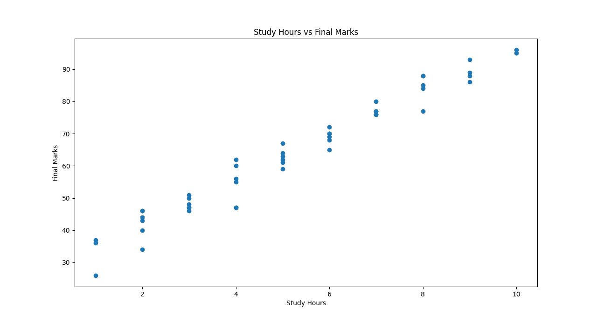

# Student Performance Predictor using Machine Learning

## Description
This project is a machine learning-based system that predicts a student's final marks based on various academic and lifestyle factors. The model analyzes inputs such as study hours, attendance, assignments completed, internal marks, and sleep hours to estimate the final exam performance of a student.
It is built using Python and uses a Linear Regression model for prediction.

---

## Objectives
- To build a machine learning model for predicting student performance
- To understand the relationship between study habits and academic results
- To apply regression techniques on structured data
- To create a simple and usable prediction system

---

## Features
- Predicts final marks based on multiple input factors
- Uses real-like dataset for training
- Provides accurate and realistic predictions
- Allows user to enter custom input via terminal
- Includes graphical visualization of data trends

---

## Inputs Required
The model requires the following inputs:

| Feature | Description |
|--------|------------|
| study_hours | Number of hours studied |
| attendance | Attendance percentage |
| assignments_completed | Number of assignments completed |
| internal_marks | Marks in internal exams |
| sleep_hours | Average sleep hours |

---

## Output Generated

The system generates the **predicted final marks** of a student based on the input values provided.

The output is a **numerical value (marks out of 100)**.

---

### Example Input
                Enter student details to predict marks:
                Enter study hours: 6
                Enter attendance (%): 85
                Enter assignments completed: 8
                Enter internal marks: 20
                Enter sleep hours: 7

---

### Corresponding Output
                Predicted Final Marks: 76.48

---

### Explanation

The model analyzes the relationship between the input features and predicts the most likely final marks using the trained Linear Regression model.

---
## Sample Graph

### Study Hours vs Final Marks

This graph shows the relationship between the number of study hours and the final marks obtained by students.

#### How to Run the Project

Follow these steps to run the project on your system:

### 1. Clone or Download the Repository
Download the project folder or clone it from GitHub.

---

### 2. Open the Project in VS Code
Open the folder containing the project files in **Visual Studio Code**.

Make sure the following files are present in the same folder:

- `student_performance_predictor.py`
- `student_data_realistic.csv`
- `README.md`

---

### 3. Install Required Libraries
Open the terminal in VS Code and run:

             pip install pandas numpy matplotlib scikit-learn
### 4.Run the Python File

In the terminal, run:

              python student_performance_predictor.py

### 5.Enter Student Details

The program will ask the user to enter

### 6.View the Prediction

After entering the details, the model will display the predicted final marks.

### Model Performance

The model was evaluated using standard regression metrics to measure prediction accuracy.

### Evaluation Results
- **Mean Absolute Error (MAE):** 3.27  
- **R² Score:** 0.956  

### Interpretation
- The **Mean Absolute Error (MAE)** shows that the model is off by around **3 marks on average**.
- The **R² Score** indicates that the model explains about **95.6% of the variation** in student final marks.

### Technologies Used

The following technologies and libraries were used in this project:

- **Python** → Core programming language used for building the project
- **Pandas** → Used for loading and handling the dataset
- **NumPy** → Used for numerical operations
- **Matplotlib** → Used for data visualization and plotting graphs
- **Scikit-learn** → Used for machine learning model training and evaluation
- **Linear Regression** → Machine learning algorithm used for prediction
- **VS Code** → Code editor used for development

